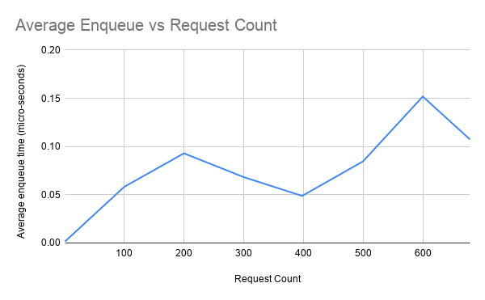
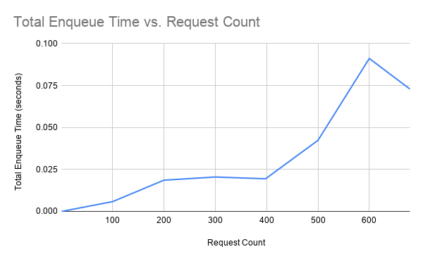

# Benchmark
## Enqueue API Stress Test
This test was done to measure latency profile of enqueue_shared_queue() under various loads while consuming messages from the singleston service at the highest rate possible using on_queue_ready().

### Average single enqueue time vs Request load (per second)

### Total enqueue time for various loads (per second)

On my machine (2 Cores and 4 Logical processors), proxy send empty responses after 680~ requests per second.